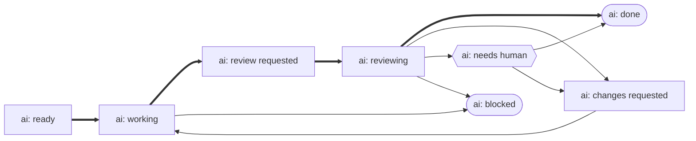

# AI work lifecycle

Agent work runs as **two loops**: implement (`work-implement` and its queue) builds and pushes, review (`work-review` and its queue) judges the result as a structurally different agent. Nothing passes between them in memory — the issue's `ai:` label is the entire handover, which is why a crashed run resumes instead of restarting and why both loops can drain at the same time.

Four skills therefore read and write one shared vocabulary of eight states. Each skill documents the transitions **it** owns; this page is the vocabulary itself, in one place.

The lifecycle is **symmetric** — each loop has a **waiting** state and an **in-flight** state:

The thick path is the healthy one. **`ai: reviewing` appears only when the review lease is enabled** (`work.labels.reviewing`, opt-in and off by default) — with it off, the review loop's verdicts come straight off `ai: review requested`, exactly as before the label existed.

## The eight labels

| Label                   | Means                                                        | Owned by            |
| :---------------------- | :----------------------------------------------------------- | :------------------ |
| `ai: ready`             | scoped and approved for an agent to pick up                  | human (the opt-in)  |
| `ai: working`           | an agent is implementing, including committed-but-not-pushed | implement loop      |
| `ai: review requested`  | pushed, awaiting **AI** review                               | review loop (input) |
| `ai: reviewing`         | an agent is reviewing now — the review loop's lease (opt-in) | review loop         |
| `ai: changes requested` | the AI review wants changes — back to the implement loop     | review → implement  |
| `ai: needs human`       | escalated; a human must review or decide                     | human               |
| `ai: done`              | AI-reviewed and accepted                                     | terminal            |
| `ai: blocked`           | cannot proceed — broken, or needs a human call               | side exit           |

A few are easy to misread:

- **`ai: ready` is the only label a human sets by hand.** That is what makes the drains unattended — an issue carrying it has already been approved, so neither queue asks again before working it.
- **`ai: review requested` and `ai: reviewing` are two different review states.** `ai: review requested` means pushed and waiting for an AI reviewer (the counterpart of `ai: ready`); `ai: reviewing` means a reviewer has claimed it and is judging now (the counterpart of `ai: working`). Neither waits on a person — that is `ai: needs human`. `ai: reviewing` is **opt-in**: off unless the repo sets `work.labels.reviewing`, and it earns its keep as a **lease** — a tracker-global claim that stops two clones reviewing one issue and writing competing verdicts, which a checkout-local lock cannot. **That last part holds only where the tracker is a server.** On the **local** tracker below the store is a directory inside the checkout, so the lease reaches exactly as far as the lock and no further; it is still useful within one checkout, but it is not a cross-clone claim there and the recommendation is to leave `work.labels.reviewing` off.
- **`ai: done` means reviewed and accepted, not merged.** Shipping is the release flow's business.

The labels are managed as infrastructure in `kirchDev/infrastructure` and mirrored into Linear by byte-identical name, so the same eight states exist on both trackers. Which label carries which meaning is remappable per repo under `work.labels` — the config key is what the skills reason about, the string only what the tracker shows.

On the **local** tracker ([ADR-0023](../99.adr/0023-back-the-local-tracker-with-committed-files.md)) there is no label at all: the same eight states are written into an issue file's `state` frontmatter field, by their **config key**. That is the clearest demonstration of the sentence above — the key is the lifecycle, and the string is one tracker's way of showing it.

Changing a label string is a **changeover**, not an edit: the new string must exist on the tracker before any skill copy adopts it, and open issues must be relabelled onto it. A string living under two names at once splits the very queue it should partition, and the split is **silent** — `gh issue list` answers a missing label with exit 0 and an empty list. The same caution applies to switching `reviewing` on: leave it off until **every** drain runs a copy that knows the lease, or an unaware drain writes a competing verdict.

## Where the mechanics live

A skill installs without this docs tree, so each carries its own rules rather than pointing here:

| For                                                                   | Read                                                                                                                                            |
| :-------------------------------------------------------------------- | :---------------------------------------------------------------------------------------------------------------------------------------------- |
| The state machine, transitions, leasing, reconcile, selection queries | [`work-implement/REFERENCE.md`](../../skills/work/work-implement/REFERENCE.md)                                                                  |
| Verdicts, the round cap, the escalation policy, feedback channels     | [`work-review/REFERENCE.md`](../../skills/work/work-review/REFERENCE.md)                                                                        |
| Why the loops are split, and the decisions behind the label set       | [`work-implement/DESIGN.md`](../../skills/work/work-implement/DESIGN.md)                                                                        |
| Draining, ordering, caps and locks                                    | [`work-implement-queue`](../../skills/work/work-implement-queue/SKILL.md) · [`work-review-queue`](../../skills/work/work-review-queue/SKILL.md) |

How these four sit among the other fifteen skills: [skill interplay](1.skill-interplay.md).
