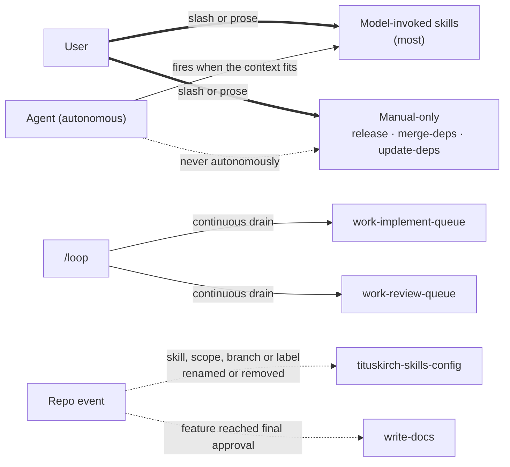
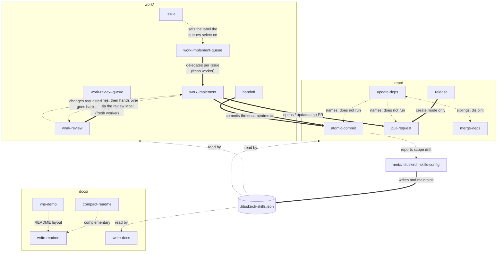

# Skill interplay and triggers

No skill in this repository is an island: one delegates to another, several read the same config file, and a few fire without anyone asking. This page is the map. Each skill's own `SKILL.md` and `REFERENCE.md` remain authoritative for how it behaves — what follows is only how they connect.

The authoring skill `write-a-skill` is deliberately absent: it lives globally, is user-invoked, and is the tool for _writing_ skills rather than a participant at runtime.

## How a skill gets started

| Trigger        | Who           | How                                                                             | Edge   |
| :------------- | :------------ | :------------------------------------------------------------------------------ | :----- |
| Slash or prose | User          | `/skill-name`, or a plain request ("cut a release") that matches `description`  | `==>`  |
| Autonomous     | Agent         | fires the skill itself when the context fits — except the manual-only ones      | `-->`  |
| Delegation     | Skill → skill | one skill calls another at runtime to do that skill's job                       | `==>`  |
| Proactive      | Repo event    | the skill volunteers when something happens in the repo (a rename, an approval) | `-.->` |
| `/loop`        | Harness       | repeats a queue skill continuously                                              | `-->`  |

None of these skills sets `disable-model-invocation`, so two classes exist:

- **Model-invoked** — the agent may fire them autonomously, and other skills can reach them. Most skills.
- **Manual-only** — `release`, `merge-deps` and `update-deps` are model-invoked so prose triggers and reachability still work, but they **never fire by themselves**. Each says so in its own description.

The four skills named individually are model-invoked like the rest; they appear separately to show their **additional** triggers — `/loop`, config drift, and a shipped feature.

## How the skills reach each other

**Solid arrows** are real delegation — one skill hands the work to another and lets it own that step. **Dashed arrows** are a data relationship, a soft reference, or a config read; nothing is invoked.

Two edges are worth reading twice:

- `update-deps` **names** `atomic-commit` and `pull-request` without running them. It updates the manifests and stops — it never commits, pushes, or opens a PR.
- The handover between `work-implement` and `work-review` is dashed, not solid. Neither calls the other; they communicate only through the issue's label, which is what lets the two loops run as separate processes. See [the AI work lifecycle](2.ai-work-lifecycle.md).

## The config is the shared seam

Nearly every skill reads the consuming repo's `.tituskirch-skills.json` — forge, tracker, branches, labels, language. Only `tituskirch-skills-config` writes it. That one-writer rule is why a skill never has to ask the user which tracker a repo uses, and why renaming a scope in one place propagates everywhere.

Each skill documents only the keys it reads, in its own `REFERENCE.md`; the schema itself lives once at [`tituskirch-skills.schema.json`](../../tituskirch-skills.schema.json).
