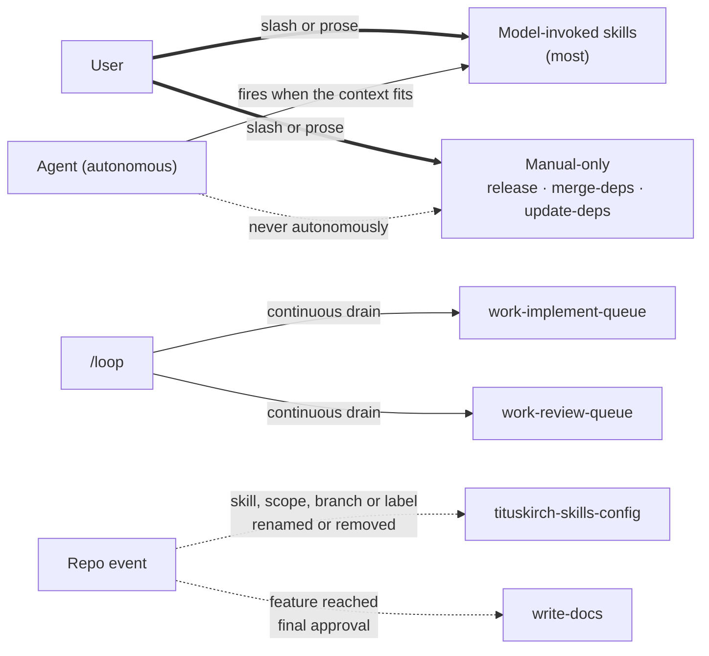
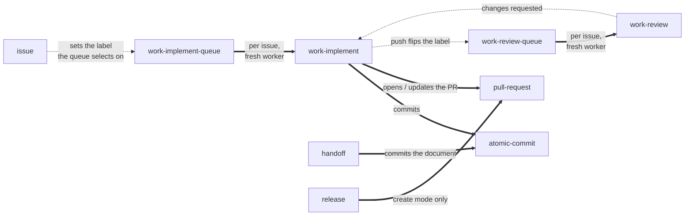

# Skill interplay and triggers

No skill in this repository is an island: one delegates to another, several read the same config file, and a few fire without anyone asking. This page is the map. Each skill's own `SKILL.md` and `REFERENCE.md` remain authoritative for how it behaves — what follows is only how they connect.

The authoring skill `write-a-skill` is deliberately absent: it lives globally, is user-invoked, and is the tool for _writing_ skills rather than a participant at runtime.

## How a skill gets started

| Trigger        | Who           | How                                                                             | Edge   |
| :------------- | :------------ | :------------------------------------------------------------------------------ | :----- |
| Slash or prose | User          | `/skill-name`, or a plain request ("cut a release") that matches `description`  | `==>`  |
| Autonomous     | Agent         | fires the skill itself when the context fits — except the manual-only ones      | `-->`  |
| Delegation     | Skill → skill | one skill calls another at runtime to do that skill's job                       | `==>`  |
| Proactive      | Repo event    | the skill volunteers when something happens in the repo (a rename, an approval) | `-.->` |
| `/loop`        | Harness       | repeats a queue skill continuously                                              | `-->`  |

None of these skills sets `disable-model-invocation`, so two classes exist:

- **Model-invoked** — the agent may fire them autonomously, and other skills can reach them. Most skills.
- **Manual-only** — `release`, `merge-deps` and `update-deps` are model-invoked so prose triggers and reachability still work, but they **never fire by themselves**. Each says so in its own description.

The four skills named individually are model-invoked like the rest; they appear separately to show their **additional** triggers — `/loop`, config drift, and a shipped feature.

## Which skills call which

Only nine of the sixteen ever invoke another skill. That subgraph is the one worth drawing — **solid** is real delegation (one skill hands over a step and lets the other own it), **dashed** is a handover through the tracker where neither side calls the other.

The two dashed edges in the middle are the load-bearing ones. `work-implement` and `work-review` never call each other — they communicate **only** through the issue's label, which is exactly what lets the two loops run as independent processes with separate locks. See [the AI work lifecycle](2.ai-work-lifecycle.md).

## Relationships that are not calls

The rest of the graph would be noise as arrows, because none of it is an invocation:

| Between                                         | Relationship                                                                                                       |
| :---------------------------------------------- | :----------------------------------------------------------------------------------------------------------------- |
| `update-deps` → `atomic-commit`, `pull-request` | **Names them without running them.** It updates the manifests and stops — it never commits, pushes, or opens a PR. |
| `update-deps` ↔ `merge-deps`                    | Siblings on the same subject, deliberately disjoint: one updates manifests, the other merges Dependabot's PRs.     |
| `atomic-commit` → `tituskirch-skills-config`    | Reports scope drift when a commit needs a scope the config's vocabulary does not have.                             |
| `compact-readme` ↔ `write-readme`               | Complementary halves: one scaffolds a README, the other slims an existing one.                                     |
| `vhs-demo` → `write-readme`                     | Follows its README layout when placing the demo.                                                                   |

## The config is the shared seam

Nearly every skill reads the consuming repo's `.tituskirch-skills.json` — forge, tracker, branches, labels, language. Only `tituskirch-skills-config` writes it.

Drawn as arrows this would be a line from one node to almost every other, which says less than the sentence does. The rule is what matters: **one writer, many readers.** That is why a skill never has to ask which tracker a repo uses, and why renaming a scope in one place propagates everywhere.

Each skill documents only the keys it reads, in its own `REFERENCE.md`; the schema itself lives once at [`tituskirch-skills.schema.json`](../../tituskirch-skills.schema.json).
