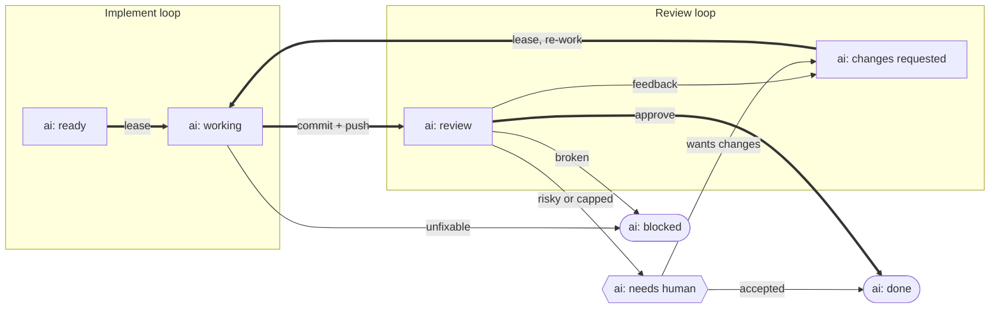

# AI work lifecycle

Agent work runs as **two separate loops**. One implements; a structurally different agent reviews. The issue's `ai:` label is the only state — nothing lives in the agent — so a crashed run resumes instead of restarting, and the two loops never need to talk to each other directly.

|           | One issue        | Continuous drain (own `/loop`, own lock) |
| :-------- | :--------------- | :--------------------------------------- |
| Implement | `work-implement` | `work-implement-queue`                   |
| Review    | `work-review`    | `work-review-queue`                      |

The reviewer is never the agent that wrote the code. That is the point of splitting the loops: a fresh agent reading the diff against the issue has no "I just built this" bias, and the locks are separate so both drains run at the same time in one repo.

## The state machine

Each box is a label on the issue. The two boxed lanes are the two loops — an issue moves right through the implement lane, crosses to the review lane when it is pushed, and either leaves at the top or comes back down for another pass.

The **thick path** is the happy one: lease, push, approve. Everything thin is an exception — a second pass, an escalation, or a dead end.

Three shapes, three meanings: a **rectangle** is a state a loop owns and will act on by itself, the **hexagon** waits on a person, and a **rounded box** is terminal — no loop touches the issue again.

`review --> needs human` covers both escalation causes at once: a change that is sound but too risky to accept unattended, and one that has burned through the round cap. Who owns each transition, in full: [`work-implement/REFERENCE.md`](../../skills/work/work-implement/REFERENCE.md#lifecycle-state-machine).

## The seven labels

| Label                   | Means                                                        | Owned by            |
| :---------------------- | :----------------------------------------------------------- | :------------------ |
| `ai: ready`             | scoped and approved for an agent to pick up                  | human (the opt-in)  |
| `ai: working`           | an agent is implementing, including committed-but-not-pushed | implement loop      |
| `ai: review`            | pushed, awaiting **AI** review                               | review loop (input) |
| `ai: changes requested` | the AI review wants changes — back to the implement loop     | review → implement  |
| `ai: needs human`       | escalated; a human must review or decide                     | human               |
| `ai: done`              | AI-reviewed and accepted                                     | terminal            |
| `ai: blocked`           | cannot proceed — broken, or needs a human call               | side exit           |

`ai: ready` is the only label a human sets by hand, and it is what makes the drains unattended: an issue carrying it has already been approved, so neither queue asks again before working it.

Labels are managed as infrastructure in `kirchDev/infrastructure` and mirrored into Linear by byte-identical name, so the same seven states exist on both trackers. Which label means what is configurable per repo under `work.labels`.

## Rules that span both loops

- **The push is the boundary.** `working` means "no reviewable artifact on the remote yet" — including work that is committed locally. Only the push flips the issue to `review`. Pushing per issue is the default: it pipelines the two loops and keeps the crash radius to one issue.
- **A crash is reclaimed, not lost.** Each loop reconciles before it selects. A `working` issue with nothing pushed goes back to `ready` for a redo; one that crashed after pushing lands in `review`. No separate "done but not pushed" state is needed.
- **The fix loop is bounded.** After two AI-review rounds without a pass, the reviewer escalates to `needs human` instead of requesting changes again. The round count is derived from the issue's label-transition events, not a counter someone has to maintain — see [`work-review/REFERENCE.md`](../../skills/work/work-review/REFERENCE.md). The cap is `work.review.maxRounds`, default 3.
- **Escalation is a judgment call, with a floor.** The reviewer escalates on sensitive surfaces (auth, secrets, payments, infrastructure, deletions, anything externally visible), on an unclear spec, on a change too large to be confident about, and on red checks it cannot tie to the diff.
- **`done` means reviewed, not merged.** On a shared branch (`work.branch: "branch:dev"`) the commit lands on `dev` before the review happens — review-after-land. The issue still only reaches `done` once the review passes; feedback is fixed forward.

## Where the detail lives

This page is the map. The mechanics belong to the skills:

- [`work-implement`](../../skills/work/work-implement/SKILL.md) — claiming, branching, verifying, pushing. Its [`REFERENCE.md`](../../skills/work/work-implement/REFERENCE.md) holds the lease rules, the reconcile recipes and the selection queries; its [`DESIGN.md`](../../skills/work/work-implement/DESIGN.md) explains why the loops are split.
- [`work-review`](../../skills/work/work-review/SKILL.md) — the verdict table, the round count, the escalation policy and the feedback channels.
- [`work-implement-queue`](../../skills/work/work-implement-queue/SKILL.md) and [`work-review-queue`](../../skills/work/work-review-queue/SKILL.md) — the drains, their ordering, caps and locks.
