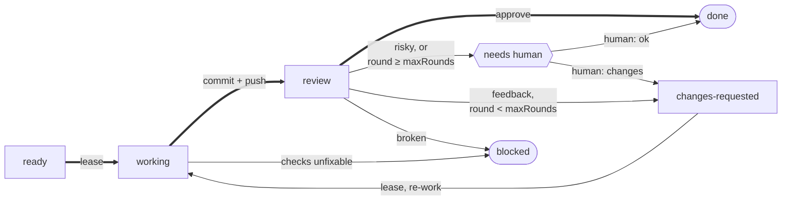

# work-implement / work-implement-queue — Reference

Shared mechanics for [`work-implement`](SKILL.md) (the unit) and `work-implement-queue` (the drain). One tracker per repo (GitHub `gh` / Linear MCP), chosen by config. Reuses the `issue` skill's config file and catalog cache.

## Principle

> The **queue is the tracker**, the **worker is stateless.** Each issue's state lives in its lifecycle label — `ready → working → review → {changes-requested → working | needs human | blocked | done}` — not in the agent. Every run reads state fresh from tracker + git, so a crashed run **resumes** instead of restarting and a repeated run is **idempotent**.

**Two loops share this lifecycle.** The **implement loop** ([`work-implement`](SKILL.md) / `work-implement-queue`) owns `ready`/`changes-requested → working → review`; the **review loop** (`work-review` / `work-review-queue`) owns `review → {done | changes-requested | needs human | blocked}`, reviewed by a **different** agent. `review` (implement → review) and `changes-requested` (review → implement) are the two hand-off labels. This file documents the shared mechanics and the implement side; the review side lives in `work-review/REFERENCE.md`.

## Config

`work.*` in the repo-root `.tituskirch-skills.json`. Resolution per setting: **config → default**. **Resolve it before reading it** — [Reading the config](#reading-the-config) is the single statement of how, including what happens when `jq` is absent.

**The check command is not in this section.** It is the root `verify` key — a fact about the repo, shared with `update-deps` and `merge-deps`, which run the same command at their own moments. Keeping it out of `work.*` is deliberate: `work: false` turns off these four skills, and that must not withdraw the repo's checks from skills it says nothing about.

```json
{
  "work": {
    "tracker": "github",
    "cap": 10,
    "branch": "worktree",
    "parallel": false,
    "labels": {
      "ready": "ai: ready",
      "working": "ai: working",
      "review": "ai: review",
      "changesRequested": "ai: changes requested",
      "needsHuman": "ai: needs human",
      "done": "ai: done",
      "blocked": "ai: blocked",
      "repo": false
    },
    "priorityLabels": ["urgent", "high", "medium", "low"],
    "review": { "maxRounds": 3 },
    "linear": {
      "team": "Engineering",
      "statuses": ["Todo", "In Progress"],
      "states": {
        "ready": "Todo",
        "working": "In Progress",
        "review": "In Review",
        "changesRequested": "Changes Requested",
        "needsHuman": "Needs Human",
        "done": "Done"
      }
    }
  }
}
```

| Key                                         | Effect                                                                                                              |
| :------------------------------------------ | :------------------------------------------------------------------------------------------------------------------ |
| `work.tracker`                              | `github` or `linear`; falls back to `issue.tracker`                                                                 |
| `work.cap`                                  | max issues a single drain works (mandatory bound; default 10)                                                       |
| `work.branch`                               | `worktree` (own branch + PR per issue) or `branch:<name>` (all issues on one shared branch, e.g. `branch:dev`)      |
| `work.parallel`                             | `false` sequential / `true` concurrent — independent of `branch` (see [Branch strategy](#branch-strategy))          |
| `work.labels.*`                             | lifecycle label names; each is a **string** or **`false`** (mechanic off — see below)                               |
| `work.labels.repo`                          | Linear repo-scope label (a string) or `false`; the [single source](#repo-scope) of "this Linear issue is this repo" |
| `work.labels.{changesRequested,needsHuman}` | the two review hand-off labels (labelOrOff); consumed by the `work-review` loop                                     |
| `work.review.maxRounds`                     | max AI-review rounds before the reviewer escalates to `needsHuman`; default 3 (see `work-review`)                   |
| `work.priorityLabels`                       | GitHub priority labels, highest first; Linear ignores these (native priority field)                                 |
| `work.linear.team`                          | Linear team name/key/id, resolved via the cache; falls back to `issue.linear.team`                                  |
| `work.linear.statuses`                      | Linear workflow states that count as startable                                                                      |
| `work.linear.states`                        | lifecycle step → Linear workflow state name; **no default** — see below                                             |

**`false` disables a mechanic:** `labels.ready: false` → no AI gate (any matching issue is eligible); `labels.working: false` → no lease label (weaker race protection); `labels.review: false` → the PR's existence is the signal; `labels.blocked: false` → comment only / Linear state; `labels.repo: false` → no repo filter (GitHub, or a single-repo Linear team).

**`linear.states` needs no `false` — absent already means off.** Every `labels.*` key has a **default** (`ai: ready` …), so absent means "use the default" and `false` is the only way to say "off". `linear.states` has **no default**: Linear state names are per-team (`In Progress` / `Doing` / `Started` …) and nothing in the skill can derive them. So the mapping is off unless the repo writes it, and each step is independent:

| Config                       | Behaviour                                                                         |
| :--------------------------- | :-------------------------------------------------------------------------------- |
| `states` omitted             | no state writes at all — the **lifecycle label alone** carries the issue          |
| a step omitted from `states` | that transition writes the label only and **leaves the workflow state untouched** |
| a step mapped                | the state is written **with** the label, in the same `save_issue` call            |

Leaving the state untouched is a defined outcome, not a degraded one — the label is [operative for eligibility](#label-vs-body-precedence), so the lifecycle is correct either way; the repo just forgoes the Linear board reflecting it. **Guessing a state name is never correct**, with or without a mapping.

Reads `pr.base` (branch base) and the shared root `language` from the same file. Schema: the repo-root `tituskirch-skills.schema.json`.

<skills-config>

### Reading the config

The config is `.tituskirch-skills.json` at the **consuming repo's** root — committed, optional, and shared by every TitusKirch skill. Absent means detection and built-in defaults, never an error. Its keys, types and defaults are defined by [`tituskirch-skills.schema.json`](https://raw.githubusercontent.com/TitusKirch/skills/main/tituskirch-skills.schema.json).

**Resolve it before reading it.** A repo may define `profiles` — named overlays for an execution context, so a remote runner can open pull requests where a local session commits directly. [`templates/resolve-config.sh`](templates/resolve-config.sh) prints the resolved config, and every skill ships the same copy, so they all see the same values:

```sh
# Fill in this skill's own directory — the path this file was loaded from, not the
# repo being worked on. It is a blank to fill, not a variable that is already set.
skill=/absolute/path/to/this/skill

resolved=$(sh "$skill/templates/resolve-config.sh"); status=$?
case $status in
0)  [ -n "$resolved" ] || resolved='{}' ;;   # ran fine; empty means the repo has no config
10) resolved= ;;                           # no jq — read the file yourself, see below
*)  echo "resolve-config failed ($status)" >&2; exit 1 ;;
esac
```

**A failure here is never silent.** Any exit other than `0` or `10` means the resolver could not be found or could not run, and the only wrong response is to carry on with `{}` — that reports the repo's defaults as if they were its settings. Stop and say what failed.

The profile comes from `TITUSKIRCH_SKILLS_PROFILE`, falling back to `ci` when `CI` holds a truthy value, and to no profile otherwise. An unset or unknown name yields the base config unchanged.

**The merge is a rule, not just a command.** Objects merge recursively at any depth, arrays and scalars are replaced rather than concatenated, an explicit `null` sets null rather than deleting a key, and `profiles` is dropped from the result. Any path that resolves the config by other means owes the same semantics.

**`jq` may not be installed.** It ships preinstalled on none of Windows, macOS or Linux, and `gh`'s built-in `--jq` is no substitute — that filters API responses, it cannot read a local file. `resolve-config.sh` exits `10` in that case. Do **not** fall through to defaults: `Read` the file, apply the merge rule above, and carry on with the repo's real values. Nothing else is needed — no Node, no Python.

**Guard every read, resolve into a variable, then use it.** Never let a substitution reach a command flag directly — `jq -r` prints the literal string `null` for a missing key, and an empty value is silently ignored by some tools rather than matching nothing:

```sh
value=$(printf '%s' "$resolved" | jq -er '.section.key // empty' 2>/dev/null) || value=
[ -n "$value" ] || value=<documented default>
```

**Tell "off" apart from "absent".** `// empty` collapses `false` and a missing key into the same empty string, which turns a deliberately disabled mechanic into its default. Where a key may be `false`, resolve it as `select(. != null) | tostring` and test for the string afterwards.

**Snippets are POSIX `sh`.** No `[[ ]]`, no arrays, no `<<<`, and nothing that differs between GNU and BSD coreutils — the shell is whatever the user runs.

</skills-config>

## Catalog cache

Reuses the `issue` cache verbatim — `$(git rev-parse --git-common-dir)/tituskirch-skills/issue` (labels, teams, projects, states), so label names resolve to ids and teams/states are looked up without re-fetching. Same TTL (~3 days) and `--refresh`.

## Lifecycle state machine



Thick edges are the path a healthy issue takes; everything thin is an exception. A rectangle is a state one of the loops will act on by itself, the hexagon waits on a person, and a rounded box is terminal. Which loop owns which transition is the table below.

| Transition                                | Loop / Who                                                                    |
| :---------------------------------------- | :---------------------------------------------------------------------------- |
| `ready → working`                         | implement — lease, **before** any work                                        |
| `changes-requested → working`             | implement — lease for re-work; reads the review feedback                      |
| `working → review`                        | implement — after commit + **push** (the artifact is now reviewable)          |
| `working → blocked`                       | implement — checks unfixable or a genuine human call                          |
| `review → done`                           | review — AI approve (low-risk), **or** a human "looks good" via `needs human` |
| `review → changes-requested`              | review — AI requests changes, round < `maxRounds` (feedback posted)           |
| `review → needs human`                    | review — approve-but-risky, can't judge, or round ≥ `maxRounds`               |
| `review → blocked`                        | review — broken beyond a fixable change                                       |
| `needs human → done \| changes-requested` | the human's verdict, applied by `work-review`                                 |

### Terminal `done`, and what `review` means now

- **`review` = awaiting AI review** by a **different** agent — not "awaiting a human". The `work-review` loop consumes it and writes the verdict.
- **`done` = AI-reviewed and accepted** (low-risk), or accepted by a human via `needs human`. It does **not** mean "merged": GitHub's `Closes #<n>` and Linear's integration fire only on a **default-branch** merge, which a non-default `pr.base` (e.g. `dev`) never triggers — so shipping is the rollup merge's business, not the queue's.
- **`review-after-land`** — under `branch:<name>` the commit lands on the branch **before** review; the issue is still not `done` until review passes, and a `changes-requested` verdict is fixed **forward** (more commits), never reverted. Details: `work-review`.

### Reconcile

Each loop's drain reconciles its own orphans **first**, before building its queue — drains run anyway, so no separate trigger is needed. There are **two**:

**Implement reconcile** (this loop, `work-implement-queue` step 2) — reclaim **`working` orphans**: an issue leased `ready → working` but abandoned when a worker crashed **before its push**. The [single-flight lock](#lease--race-rules) guarantees no live worker holds it at reconcile time, so check for a **pushed artifact** (a PR / pushed commit for the issue):

| Pushed artifact? | Meaning                                           | Action                                                                                                         |
| :--------------- | :------------------------------------------------ | :------------------------------------------------------------------------------------------------------------- |
| **none**         | crashed **before** the push                       | flip back to `ready`, drop the assignee → re-worked fresh; `blocked` if it left an unrecoverable partial state |
| **present**      | crashed **after** the push, before the label flip | advance to `review` — the work is already reviewable; finish the interrupted hand-off, don't redo it           |

Without this, a `working` orphan carries neither `ready` nor `review`, so nothing would ever reclaim it — the hole that would contradict the [resume-instead-of-restart principle](#principle).

**Review reconcile** (the `work-review-queue` loop) — for issues in `review`, close out **out-of-band human actions on the PR**: merged → `done` (implicit acceptance), closed-unmerged → `blocked`. Full rules: `work-review-queue`.

Both move **labels only**, never branches, and are **idempotent** — nothing to reclaim is the normal result.

```bash
# GitHub — does this issue already have a pushed PR? (distinguishes crash-before vs crash-after-push)
gh api graphql -f query='
  query($owner:String!,$repo:String!,$n:Int!){
    repository(owner:$owner,name:$repo){
      issue(number:$n){
        closedByPullRequestsReferences(first:10, includeClosedPrs:true){
          nodes{ number state merged baseRefName }
        }
      }
    }
  }' -F owner=<owner> -F repo=<repo> -F n=<n>
```

For `branch:<name>` with no PR, "pushed artifact" = the issue's commits already on the remote branch (`git log origin/<branch> --grep "#<n>"`). **Linear** — the GitHub integration links the PR as an attachment; read it via `get_issue` for the PR url, then ask GitHub for state (`gh pr view <url> --json state,merged`).

### Label vs body precedence

Label and body are **both live**, and they can disagree — a body written at creation ("early idea, not ready yet") outlives the label a human flips days later. Split the question in two:

| Question                                            | Decided by              | Why                                                            |
| :-------------------------------------------------- | :---------------------- | :------------------------------------------------------------- |
| **May this issue be worked?** (eligibility)         | the **lifecycle label** | the queue's contract, and the thing a human flips deliberately |
| **What is the work?** (scope, requirements, extent) | the **body**            | the label carries no detail; only the text says what to build  |

**The label is operative.** A body line contradicting the current label — "do not implement yet", "intentionally **not** marked `ai: ready`" — describes the issue as it stood when written; it is **not** a veto over a label a human has since set. It **never** silently overrides the label into a block. Treat it as **stale text** and **surface it**: warn in the run's report and note it on the issue, so the human can correct whichever side is wrong. The agent's job is to flag the contradiction, not to adjudicate it.

This does not disarm the `blocked` side-exit: work whose **requirements** are genuinely ambiguous, or that genuinely needs a human call, still exits to `blocked` — on the **substance** of the work, never on the body's opinion about eligibility.

## Selection query

Eligible = matches **all** configured filters. Self-select (one issue) and drain (all, ordered) use the same query.

- **labels** — the implement loop selects issues with `labels.ready` **or** `labels.changesRequested` (its two inputs; skip a label that is `false`); never already `working`/`blocked` by someone else. Labels are the **only** eligibility input — issue text is never read for consent ([label vs body](#label-vs-body-precedence)). (The review loop's input is `labels.review` — see `work-review`.)
- **repo scope** — Linear only: has `labels.repo` (unless `false`). Skipped on GitHub (repo-local by nature).
- **team** — Linear only: `work.linear.team`.
- **status** — Linear: state ∈ `work.linear.statuses`. GitHub: `--state open`.
- **order** — by priority. Linear native priority field; GitHub by `work.priorityLabels` (highest first), then creation order. Under `branch:<name>` this order is then re-sorted so prerequisites come first — [dependency ordering](#dependency-ordering).

**Resolve every label before it reaches the query** — a bare `$(jq …)` inside the search string yields `label:"",""` when `jq` is missing, which matches nothing and drains an empty queue in silence:

```bash
# label-or-off: false is "mechanic off", absent/unreadable is "use the default"
ready=$(printf '%s' "$resolved" | jq -er '.work.labels.ready | select(. != null) | tostring' 2>/dev/null) || ready=
[ -n "$ready" ] || ready='ai: ready'
[ "$ready" = 'false' ] && ready=
chreq=$(printf '%s' "$resolved" | jq -er '.work.labels.changesRequested | select(. != null) | tostring' 2>/dev/null) || chreq=
[ -n "$chreq" ] || chreq='ai: changes requested'
[ "$chreq" = 'false' ] && chreq=

# GitHub — implement-loop inputs (ready OR changes-requested); comma = OR within a search qualifier
gh issue list --state open \
  --search "label:\"$ready\",\"$chreq\"" \
  --json number,title,labels,createdAt
```

Both inputs empty means **no eligible query exists** — report that as a config problem, never as an empty queue. Skip a label that is `false` and build the search from the remaining one.

**Ready-gate off** (`labels.ready: false`): the query above can't filter by a ready label — list open issues and instead **exclude** the in-flight ones (`--search "-label:<working> -label:<blocked>"`), so "never already `working`/`blocked`" still holds without a gate to lean on.

Linear: `list_issues` filtered by team + label(s) + states; order by the native priority field.

## Lease & race rules

- **Claim before work** — flip `ready → working` + assign, _then_ implement. A second consumer sees "not ready" and skips.
- **Fresh fetch each iteration** — a drain re-queries the next eligible issue every loop; it never snapshots the whole queue (stale `ready` states would be re-worked). [Dependency ordering](#dependency-ordering) plans the _sequence_ up front but does not exempt an issue from that re-check.
- **Single-flight lock** — `work-implement-queue` takes a lock file in the git common dir; a second drain in the same repo exits. This (not the label flip, which is not a true compare-and-swap) is what makes multi-consumer safe **within a repo**; cross-repo isolation on a shared Linear team comes from [repo scope](#repo-scope).
- **Direct invocation honours the lock too.** The lock is created by `work-implement-queue` for the whole batch, and a drain's workers run under it (they do not re-take it). A **directly-invoked** `work-implement` (`/work-implement 42`) runs outside a drain, so it must itself honour the lock: if a drain holds it, **stop and report** (the drain will reach the issue); otherwise take the lock for the run and release it after. This closes the race where a direct run and a drain both read `ready` and lease the same issue, and it stops the drain's [reconcile](#reconcile) from mistaking a live direct run's `working` issue for a crashed orphan.
- **Clean-tree assert** between issues; a worker that left the tree dirty halts the drain rather than stacking onto uncommitted work.
- **Git's `index.lock`** is the last-resort backstop; concurrency is made _impossible by construction_ (one live worker per tree), not merely locked.

## Branch strategy

Two **independent** knobs — `work.branch` (where work lands) × `work.parallel` (how it runs):

| `branch` \ `parallel` | `false` (sequential)                      | `true` (parallel)                                           |
| :-------------------- | :---------------------------------------- | :---------------------------------------------------------- |
| **`worktree`**        | own branch + PR per issue, one tree, hops | own branch + PR per issue, **each in its own git worktree** |
| **`branch:<name>`**   | all issues on `<name>`, sequential        | work in worktrees, **integrated serialized** onto `<name>`  |

- **Worktrees are the mechanism of `parallel: true`**, not a separate mode. Sequential runs need none.
- **Serialized integration** — for a shared `branch:<name>` target under `parallel: true`, parallel work is produced in isolated worktrees and landed one commit at a time (push → rebase → retry). This is what makes `branch:dev` + `parallel` race-free.
- **`worktree`** branches off `pr.base`; the worktree with committed+pushed work is removed after the PR is opened (commits live on the remote/branch).
- **Dependencies** — under `branch:<name>` the drain works prerequisites first within the run ([dependency ordering](#dependency-ordering)); the shared branch accumulates, so the dependent issue just sees the code. Under `worktree` each issue branches off a clean `pr.base` and sees nothing of its siblings, so the `ready` gate stays the mechanism — a dependent issue is not `ready` until its parent merges. Stacked branches are a v2 concern (see [DESIGN.md](DESIGN.md)).

## Dependency ordering

**`branch:<name>` only.** A shared branch **accumulates** — every issue commits onto the same branch, so a dependent issue sees its prerequisite's work by simply being worked **after** it. No branch-off-parent, no PR base retarget, no rebase cascade — those are worktree-mode stacking (v2, [DESIGN.md](DESIGN.md)). Single-branch mode needs only the **right order**. Under `worktree` this whole section is inert: each issue branches off a clean `pr.base`, so the `ready` gate remains the dependency mechanism.

### Edges

An edge **A → B** reads "**A must land before B**". Both relation kinds point that way, and both are read straight from the tracker — never inferred from the issue text:

| Edge                              | GitHub                              | Linear                           |
| :-------------------------------- | :---------------------------------- | :------------------------------- |
| **prerequisite** (`A` blocks `B`) | `blockedBy` / `blocking`            | `blocked by` / `blocks` relation |
| **parent → child**                | `parent` / `subIssues` (sub-issues) | `parent` / sub-issues            |

**GitHub — not reachable via `gh issue list` or `gh issue view --json`** (neither exposes a `parent`, `blockedBy` or sub-issue field); use the API per candidate. `blockedBy` may cross repos — keep only same-repo ends:

```bash
gh api graphql -f query='
  query($owner:String!,$repo:String!,$n:Int!){
    repository(owner:$owner,name:$repo){
      issue(number:$n){
        number
        parent{number}
        blockedBy(first:50){nodes{number repository{nameWithOwner}}}
      }
    }
  }' -F owner=<owner> -F repo=<repo> -F n=<n>
```

**Linear** — `list_issues` does **not** return relations; fan out `get_issue(id, includeRelations: true)` per candidate and read the `blocked by` relations plus `parent`.

### Building the order

1. **Candidates** — the eligible issues from the [selection query](#selection-query), in priority order.
2. **Fetch edges** per candidate (the fan-out above).
3. **Keep internal edges only** — drop any edge whose other end is outside the candidate set; those are handled by [cross-set prerequisites](#cross-set-prerequisites) below.
4. **Topological sort**, using the **priority order as the tiebreak** — independent issues keep their priority ranking; only a real edge overrides it.
5. **Then apply `work.cap`.** Order first, cap second: a prefix of a topological order is closed under prerequisites (a child's parent always precedes it, so it is in the prefix too). Capping a priority-ordered list first could strand a child without its parent.

**The order is a plan, not a snapshot** — it does not repeal [fresh fetch each iteration](#lease--race-rules). The sort says which issue is _next_; each iteration still re-checks that issue is _still_ eligible before leasing it, and an issue that went `working`/`blocked`/closed meanwhile is dropped (its dependents then fall to [cross-set](#cross-set-prerequisites) handling). Only the edges may be reused within a run — relations change far slower than lifecycle labels.

### Cross-set prerequisites

A prerequisite that is **not** in the candidate set:

- **closed / merged** → already on the branch, edge satisfied — ignore it.
- **open but not eligible** (not `ready`, `blocked`, someone else's `working`) → its code is _not_ on the branch, so the dependent issue's premise is false. **Defer the dependent issue** — do not work it this run, do not lease it, do not label it `blocked`; report it as deferred. It becomes eligible on a later run once the prerequisite lands.

### Cycles

A dependency cycle (A → B → A) has no valid order and is a **tracker-data error a human must fix**. Detect it, **skip every issue in the cycle** for this run — unleased, unlabelled — and name them in the drain report. Never break a cycle by guessing.

### Parallel

`branch:<name>` + `parallel: true` — dependent issues **cannot** run concurrently. Process the graph in **topological levels**: each level holds mutually independent issues that may run in parallel; levels run **sequentially**, with each level's [serialized integration](#branch-strategy) landing on the branch before the next starts. A chain therefore degenerates to sequential, which is the point.

## Tracker — GitHub (`gh`)

- **Lifecycle** — labels are flat (`ai: ready` …); flip with `gh issue edit <n> --add-label <x> --remove-label <y>`, assign with `--add-assignee`.
- **Dependencies** — `blockedBy` / `parent`, GraphQL-only (see [dependency ordering](#dependency-ordering)).
- **Eligible** — `gh issue list --state open --label …`. Priority via `work.priorityLabels`.
- **PR link** — `Closes #<n>` in the PR body links the PR to the issue, and auto-closes it on merge **into the default branch only**. With a non-default `pr.base` (e.g. `dev`) that merge fires neither, so the keyword is **traceability, not the route to [`done`](#terminal-done)**.
- **Reconcile** — find an issue's PRs with `closedByPullRequestsReferences` (see [reconcile](#reconcile)).
- **Label sync** — if the repo mirrors labels to Linear, that is the **integration's** job; the agent writes only the GitHub side. Never double-write.

## Tracker — Linear (MCP)

Server name varies (`mcp__claude_ai_Linear__*`, `mcp__linear__*`, …) — discover the tools at runtime, do not hardcode.

- **Lifecycle** — `save_issue` with the issue's `id` (create and update are one tool, keyed on the `id`) to set the lifecycle label + assignee, plus that step's `work.linear.states` state when one is mapped — **one atomic call**, so label and state never drift. Step unmapped, or no `states` at all → write the label + assignee and **leave the state alone**. Never invent a state name: the map is the only source, and `statuses` is an eligibility filter, not a mapping.
- **Eligible** — `list_issues` by team + `labels.ready` + `labels.repo` + `work.linear.statuses`; order by native priority.
- **Dependencies** — `list_issues` returns no relations; fan out `get_issue(includeRelations: true)` (see [dependency ordering](#dependency-ordering)).
- **Which steps write a state** — the **implement loop** writes `states.working` on the lease and `states.review` after the push. The **review loop** writes `states.done` / `states.changesRequested` / `states.needsHuman` on its verdict; the implement reconcile writes `states.ready` when it reclaims a pre-push orphan. Linear's integration may also move the issue on a default-branch merge — a bonus, never the signal waited on. `states.ready` is otherwise not written by the worker — it records where a human parks a startable issue, the anchor `statuses` should contain. The `blocked` side-exit is carried by `labels.blocked`.
- **PR lives on GitHub** — even for a Linear-tracked repo, the code PR is a GitHub PR. The branch name / PR carries the **Linear key** (`ENG-123`) so Linear's GitHub integration **links** it. That link is traceability: on a non-default `pr.base` the integration never moves the issue at all, so [`done`](#terminal-done) comes from the sign-off or the reconcile — never from waiting on Linear.
- **Team is required**; resolve `work.linear.team` to its id via the cache. `states` is optional — resolve each mapped name to its id via the cache; a name that matches **no** state in the team is a config error → report it, do not fall back to a guess.

### Repo scope

Linear puts every repo's issues in one team, so the team alone cannot say "this issue is this repo." `work.labels.repo` (a stable label, e.g. `repo: TitusKirch/envprism`) is the discriminator — the **single source of truth** for repo identity in Linear, and the cross-repo race-breaker. It is read here to **filter** and (when the `issue` skill applies it on create) to **tag** — projects are unsuitable because they are completable. Set it to a **string** to filter by that label; set it to **`false`** only for a **single-repo Linear team** — a deliberate opt-out where the team already _is_ the repo, so no filter is needed and the drain **proceeds**. The schema now **requires** the key present when `tracker: linear`, so an _absent_ key is a config error to report — never a licence to reach into another repo's issues.

## Setup

No own setup flow — `work` piggybacks on the `issue` skill's config + cache and only adds the `work.*` keys. The lifecycle labels must already **exist** on the configured tracker's catalog (the agent filters by them, it does not create them).

**When `issue` is `false`.** The work skills lean on the `issue` section three ways — `work.tracker` falls back to `issue.tracker`, `work.linear.team` to `issue.linear.team`, and the [catalog cache](#catalog-cache) is the `issue` skill's. A repo may disable the `issue` skill (`issue: false`) while still running the queue; then none of those inheritances hold. So a repo that sets `issue: false` **and** enables `work` must set `work.tracker` (and, on Linear, `work.linear.team`) explicitly, and the cache is populated by the work run itself rather than inherited. If both are needed but `work.tracker` is absent, stop and report rather than guess.
